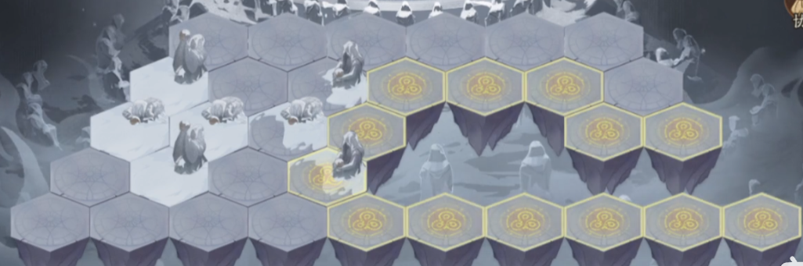
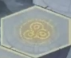
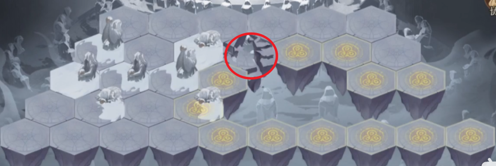
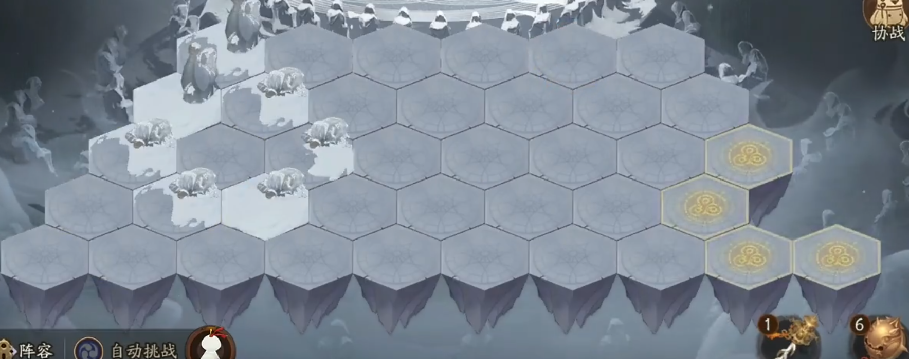
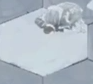
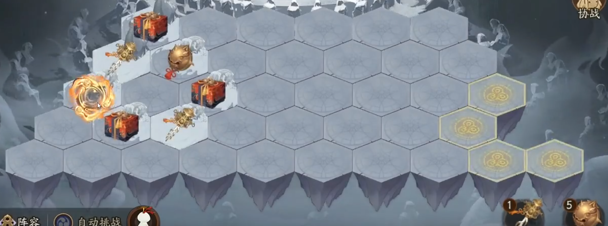
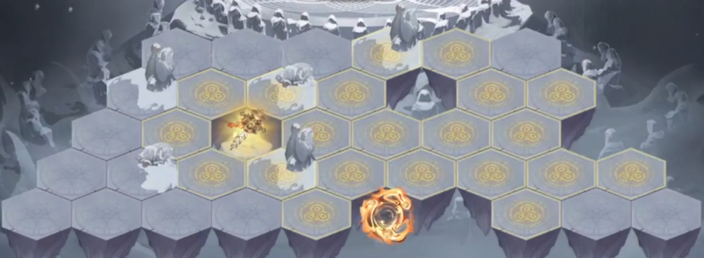
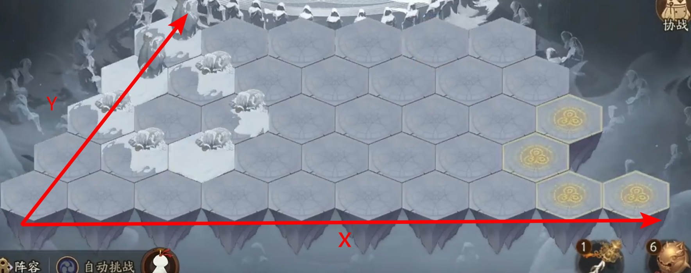
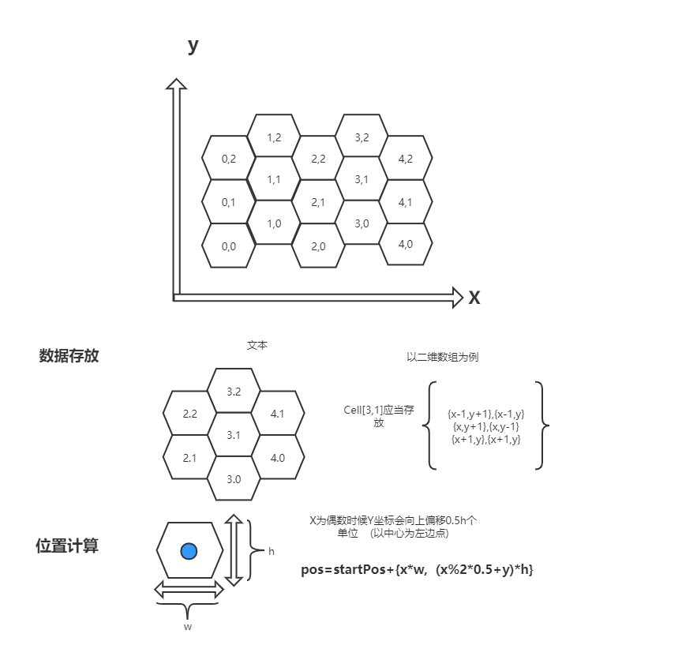

# 铃彦姬活动

## 目录

*   [场景分析](#场景分析)

    *   [地形机制](#地形机制)
    *   [下一层机制](#下一层机制)
    *   [道具与事件](#道具与事件)

*   [代码思路](#代码思路)

    *   [地图初始化](#地图初始化)
    *   [确定目标点](#确定目标点)
    *   [确定路径](#确定路径)
    *   [触发事件](#触发事件)
    *   [二次循环](#二次循环)

*   [代码细节](#代码细节)

    *   [多线程](#多线程)
    *   [模型训练](#模型训练)
    *   [六边形地图初始化说明](#六边形地图初始化说明)
    *   [文字识别](#文字识别)

*   [人工、小纸人、脚本的区别](#人工小纸人脚本的区别)

# 场景分析

## 地形机制

游戏场景如图，为六边形地图，一屏显示，不需要滚动地图，地图从下往上遵照10,9,8,7,6的格子数排列



其中可点击的地形显示为下图



点击这一地图并完成触发的事件后，会显示周围相邻的地形情况，同时之前被点击的地形会崩碎，无法再被点选



## 下一层机制

进入下一场景的方式就是找到下一层入口（开局隐藏，需要逐步探索找到）


每经过5层，入口会被替换为血量较高的BOSS并开局显示，可以直接往目标进发，击败BOSS直接进入下一层


## 道具与事件



如上图，地图中除了可点击图形、不可点击图形之外，还存在一些美术设计的图像



这是在告诉玩家这个地块不是常规战斗，而是一些事件——给宝箱、给神乐铃、给七支刀、下一层入口

点击右下角的神乐铃道具，可以显示本层的所有道具及奖励所在地图块



而七支刀会随机崩碎4块地图块，然后获得地图块的奖励，并且崩碎的地图块周围变为可选地图，可以直接战斗

如果崩碎的地块有下一层入口，那么入口会被显现出来，可以直接点击进入下一层

如果运气好直接把BOSS崩碎，那么就会直接进入下一层



# 代码思路

## 地图初始化



创建一个二维数组，将六边形地图转为二维数组保存，将不存在的地块设置值为1

```python
class Array2D:
    """
        说明：
            1.构造方法需要两个参数，即二维数组的宽和高
            2.成员变量w和h是二维数组的宽和高
            3.使用：‘对象[x][y]’可以直接取到相应的值
            4.数组的默认值都是0
    """
    def __init__(self,w,h):
        self.w=w
        self.h=h
        self.data=[]
        self.data=[[0 for y in range(h)] for x in range(w)]
 
 
    def showArray2D(self):
        for y in range(self.h):
            for x in range(self.w):
                print(self.data[x][y],end=' ')
            print("")
 
    def __getitem__(self, item):
        return self.data[item]

#创建一个10*5的地图
map2d=Array2D(10,5)
#设置障碍
map2d[9][1]= 1
map2d[9][2] = 1
map2d[8][2] = 1
map2d[9][3] = 1
map2d[8][3] = 1
map2d[7][3] = 1
map2d[9][4] = 1
map2d[8][4] = 1
map2d[7][4] = 1
map2d[6][4] = 1

```

## 确定目标点

*   如果地图上有BOSS，那么用yolov5n检测到BOSS位置后，直接将其像素坐标基于参照系左下角地块，转换为二维数组的坐标`[bx,by]`

*   如果地图上没有BOSS，那么用文字识别获取神乐铃的可用数量

    *   如果还有，就使用以显示入口所在位置，用yolov5n检测到入口后，将其像素坐标基于参照系左下角地块，转换为二维数组的坐标`[rx,ry]`

    *   如果没有，就用yolov5n找到地图上有美式设计风格的地块，随意指定其中一个为目标点，转换为二维数组的坐标`[mx,my]`

## 确定路径

用yolov5n，检测所有可点击地块，将其转换为二维数组的坐标`[dx1,dy1]`......`[dxn,dyn]`

用A星算法，求出所有可点击地块的二维数组坐标与目标点的路径列表`pathlist1`......`pathlistn`，根据路径列表的长度确定距离

用排序算法，确定这么多可点击地块中距离目标点最近的地块，这个地块对应的路径列表`pathlist`就是要后续操作依据的路径

## 触发事件

根据`pathlist`所记录的坐标，将其转换回像素坐标，然后挨个点击这些地块，每次点击都会触发事件

*   如果是战斗，就识别“战斗”，等战斗结束，识别“战斗结束”，等待几秒后随便点击一下界面，取消奖励的弹框，完成一次事件

*   如果是获得道具，等待几秒后随便点击一下界面，取消奖励的弹框，完成一次事件

*   如果是下一层入口，就是识别“确定”，进入下一层

## 二次循环

如果目标点不是BOSS也不是下一层入口，而是一个道具，那么到达目标点后跳过神乐铃的识别与使用，直接用yolov5n检测当前地图所有识别出的地块

*   如果能看到下一层入口，直接以入口为目标点，执行“确定路径”的操作

*   否则就找到地图上有美式设计风格的地块，继续随意指定其中一个为目标，然后重复“确定目标点”和“确定路径”的操作

# 代码细节

## 多线程

用win32api持续截图，创建另一个线程做检测操作。

如果使用了神乐铃，显现的入口图像会一闪一闪的，为了避免线程检测时依据的截图数据正好是入口图像不显示的时刻，检测操作在初次检测不到时，需要停止1秒再进行一次检测。

## 模型训练

用yolov5n进行迁移训练，得到检测用的模型

需要能识别可点击地块、BOSS图像、入口图像、美术风格的地块，其中美术风格地块在一开始可能是风雪样式，等后面层数高了就会变成火焰样式。

## 六边形地图初始化说明

<https://blog.csdn.net/weixin_47634555/article/details/112555965>

六边形地图也是可以转为二维数组并使用A星算法的，最后从二维数组值转回游戏图像中的像素坐标时，要根据`X`值，偏移一下`Y`值



## 文字识别

<https://zhuanlan.zhihu.com/p/342686109>

使用win32api截图，获取numpy格式的图像数据，裁切右下角道具数量，将其传给`EasyOCR`这个库的对象，进行图像识别

# 人工、小纸人、脚本的区别

人工操作肯定是最精确的操作

官方所给小纸人并不是很智能，只会一个个地块去点

上面自己写的脚本，不能完全取代人工，存在一定的“不智能”，但要比小纸人好一点
